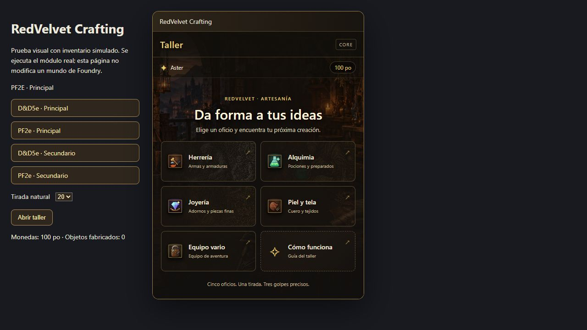
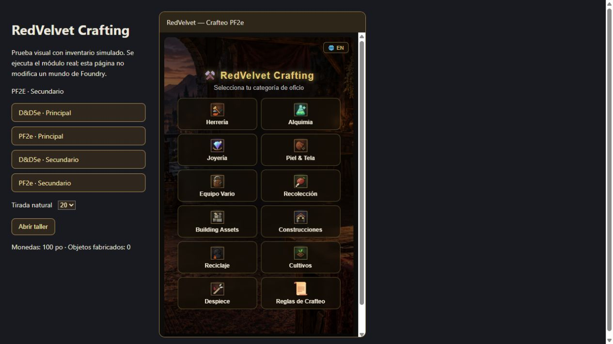

# Verificación del diseño compartido — 2026-10-08

Los talleres Core y Extendido usan la misma presentación en D&D5e y PF2e. Los adaptadores de Core que resuelven tiradas, precios, CD, monedas y entrega de objetos permanecen idénticos a los existentes antes de este trabajo. Los requisitos de herramientas D&D5e y competencia PF2e del modo Extendido se conservan.

## Comprobaciones realizadas

- 42 pruebas locales D&D5e y 8 PF2e aprobadas. Cubren lógica, aplicación, inventario y presentación; los casos Core usan adaptadores de Foundry v13/v14.
- Comparación SHA-256 de Core, helper de iconos, audio, ambos CSS, portada, 15 SVG y 20 OGG: archivos compartidos idénticos entre las dos instalaciones. Esta comparación se omite en CI cuando solo está disponible una edición.
- Menú Core revisado en navegador con inventario simulado. Los píxeles del área del taller coinciden exactamente entre las dos capturas, con el mismo actor, idioma y tamaño.
- Menú Extendido: 12 tarjetas con altura de 67 px e iconos coincidentes. Recolección: 9 tarjetas de 89 px con los mismos SVG; los nombres de habilidades conservan las diferencias de cada sistema.
- Catálogo, búsqueda sin resultados, limpieza de búsqueda y ficha de receta revisados. Los avisos de los golpes y las entregas/devoluciones están cubiertos con reloj controlado en pruebas automatizadas.
- Sintaxis de JS/JSON y 54 referencias de recursos comprobadas por edición. Los sonidos y el arte se sirven localmente.

La revisión en navegador ejecuta código del módulo con un entorno simulado; no acredita una sesión real de Foundry ni sincronización entre clientes.

## Evidencia

## Pendiente antes de publicar

1. Foundry v13 y v14 con una versión compatible del sistema: abrir `/craft` como GM con token seleccionado y como jugador propietario; verificar Core como modo predeterminado y la apertura de Extendido desde los ajustes.
2. Core: tres aciertos entregan una unidad; dos devuelven la mitad, uno un tercio y cero no devuelven monedas. Cancelar la tirada devuelve el pago completo. Cerrar el mini-juego cuenta los golpes pendientes como fallos.
3. Extendido: probar cada oficio y actividad, competencia/herramientas correspondientes, inventario, cultivo persistente y mejora de estructuras.
4. Audio activado/desactivado, volumen, teclado y movimiento reducido; verificar convivencia con los demás módulos de la mesa.
5. Autenticación Patreon real, hub y funcionamiento del soft gate; instalar el ZIP en una carpeta limpia.

Los candidatos GitHub permanecen en borrador hasta registrar estas comprobaciones. El identificador, modo predeterminado y datos persistentes del actor no se migraron.
